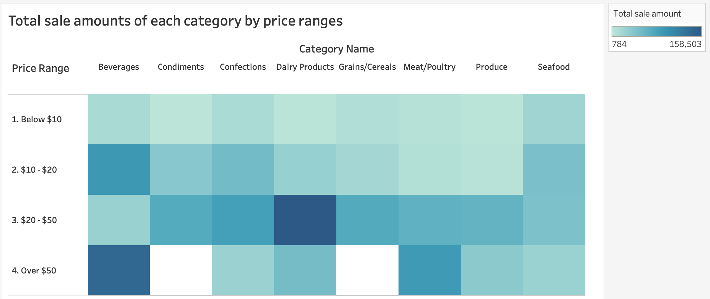
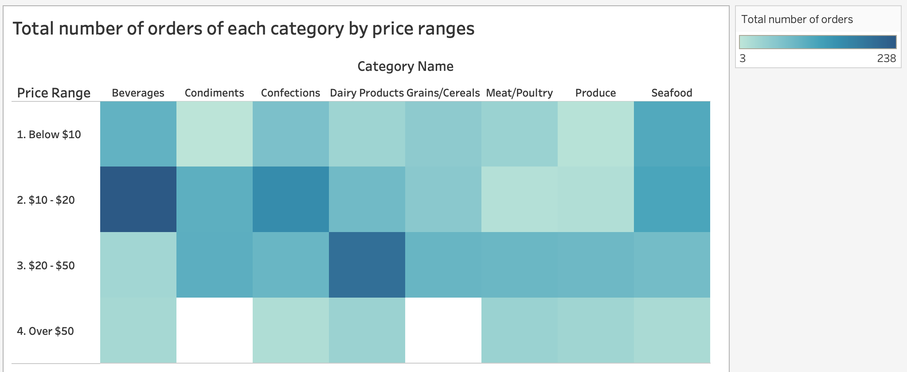
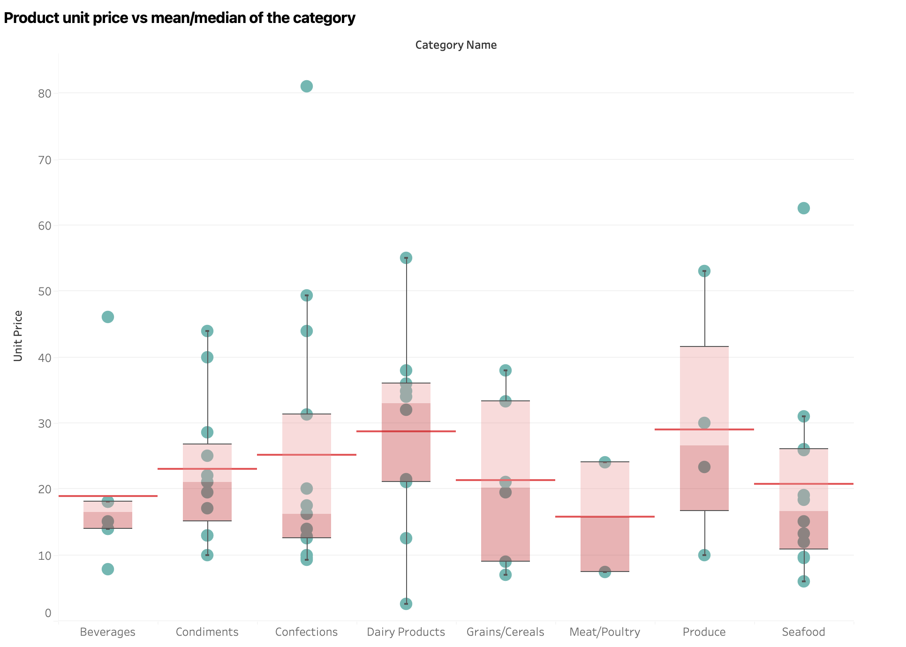
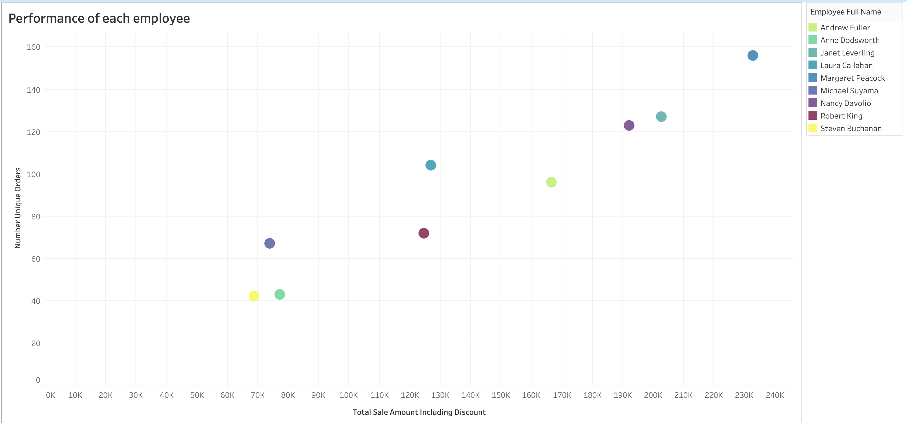
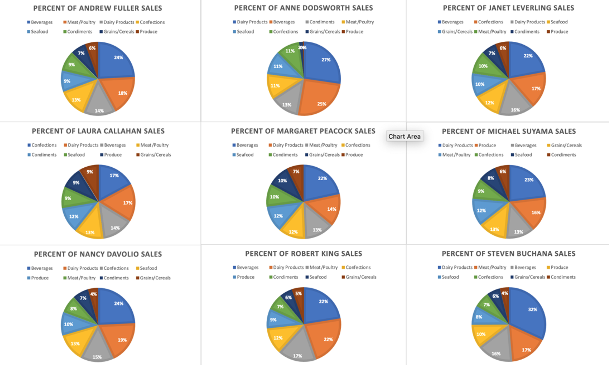

# Northwind Traders’s performance analysis 

## Description 
Leveraging sql, this project uses a database that contains sales data of a fictional company named Northwind Traders, which exports/imports goods all over the world to answer some business questions.

Use cases of following SQL concepts are demonstrated: 
- DDL (data definition): CREATE, ALTER, DROP
- Data integrity and constraints: PRIMARY KEY, FOREIGN KEY, UNIQUE.
- Basic queries: SELECT, WHERE.
- DML (Data manipulation language): INSERT, UPDATE, DELETE
- Data integrity and constraints: PRIMARY KEY, FOREIGN KEY. 
- Basic aggregate functions: COUNT, SUM, AVG, MIN, MAX
- Sorting and limiting: ORDER BY, LIMIT
- Joins: INNER JOIN, LEFT JOIN, SELF JOIN.
- Subqueries.
- Grouping: GROUP BY, HAVING.
- Window functions: ROW_NUMBER, DENSE_RANK, LEAD, LAG
- CTEs
- Procedure and Functions 
- Transaction: BEGIN, COMMIT, ROLLBACK
- Indexing for speeding up queries: order_date
- View

Besides, in the future this project will implement following concepts: 
- PREPARE, EXECUTE, DEALLOCATE for SQL injections prevention and performance optimization. 
- Backup 
- Advanced joins: CROSS JOIN, FULL JOIN
- Set operation: UNION, INTERSECT, EXCEPT
- Sharding 
- Partition

## Database setup


## Database security 
1. Role 
2. View 

## Optimization 
1. Also, consider views when dealing with complex queries. Views being a physical object on database (but does not store data physically) and can be used on multiple queries, thus provide flexibility and centralized approach. 
2. View could be indexed
3. CTE instead of subqueries. 
4. Range conditions so the database can use an index efficiently (order_date)


## Set up the database
1. Install Docker [here](https://docs.docker.com/engine/install/).
2. Clone this repository.
3. Navigate the terminal to the project folder and start a Docker instance using: 
```
docker-compose up -d
```
4. Connect to the database and run _northwind.postgre.sql_ ->  *alter_table.sql* -> _views_ -> _indexes_ -> _functions_ -> _procedures_ scripts to populate the data. 

## Tables


## Business question analysis 
Each .sql file in /queries folder yields a corresponding .csv file that answers a business question.

1. Products that are currently being offered for a specific price range ($10 to $50)


2. Shipping countries' performance in 1997

Figure 2 shows the total number of orders and average days between order date and shipping date (or average shipping days) of shipping countries in 1997. Out of 21 shipping countries, only 18 countries had 3 ≤ average shipping days ≤ 20 and total number of orders > 5. 
Overall, there is a linear relationship between average shipping days and total number of orders (the more orders, the later shipping date is). However, there is an outlier: Although Portugal only had 7 orders, its average days between order date and shipping date was 12 days. Taking order volumn into consideration, top 5 badly-performed shipping countries are Portugal, Belgium, Argentina, Ireland, and Switzerland (red circles).


3. Employee ages when hired and whom report to

Anne Dodsworth and Janet Leverling have youngest hired age (28 years old). Meanwhile, Margaret Peacock has the oldest hired age (55 years old). 


4. Months’ performance (1996 – 1997)

There are only 7 months from 1996 – 1997 that had more than 20 orders and 2500 freight. Among these 7 months, October and December in 1997 performed the best with highest total number of orders and total freight. 


5. Increase percentage of unit prices

Singaporean Hokkien Fried Mee and Queso Cabrales had their unit prices increase by more than 30%. Moreover, there was no product having increase percentage less than 10%.


6. Category performances according to their price ranges

Figure 6 and Figure 7 display performances of each category according to their price ranges. Performance can be estimated via Total sale amount or Total number of orders.

__Total sale amount:__
- Beverages: _Over $50_ price range had the highest total sale amount.
- Other categories: _$20-$50_ price range had the highest total sale amount.
- All categories: _Below $10_ price range had the lowest total sale amount.



__Total number of orders:__

- Beverages: while highest total sales amount belongs to Over $50 price range, the highest total number of unique orders belongs to $10 - $20 price range.
- Other categories: the highest total number of unique orders belongs to either $10 - $20 or 
$20 - $50 price range.
- For almost all categories: Over $50 price range has the lowest total number of unique orders



7. Current state of stocks of regional suppliers

__Unit in stock:__ Condiments accounted for the largest number of units in stock in both America and Asia, while Seafood accounted for the largest number of units in stock in both Europe and Oceania.
Number of Produce units in stock was small across all regions.

__Unit on order:__ Europe had large number of units on order across all categories (except for Meat/Poultry and Produce). Meanwhile, for the three other regions, there is only 1 – 2 categories having units on order. 


Europe had the highest reorder level. Moreover, Beverages reorder level was relatively high in all regions. 


8. Product unit price vs mean/median of the category

Figure 10 - 15 illustrate products’ unit prices compared against category mean (red line) and median (green line). 
Mean: Most of Daily Products products had their unit prices above category mean. On the contrary, other categories’ products had their unit prices below category mean.

Median: In almost all categories, half of the products had their unit prices above median. 



9. Employee performance (KPIs)

Figure 18 indicates performances of employees based on their number of unique orders and total sale amount including discount. It can be observed that these two measurements had a linear relationship (more orders → larger sale amount). Margaret Peacock has the best performance while Steven Buchanan and Michael Suyama had the worst performance. 



10. Employee performance (KPIs) across each category

Figure 19 shows employee’s percentage of total sales amount including discount against his/her total sales amount across all categories. First, Beverages accounted for the largest sale amount of 5/9 employees (Andrew, Janet, Margaret, Nancy, Robert). Meanwhile, Daily Products accounted for the largest sale amount of 3/9 employees (Anne, Michael, Steven). Only Laura had her largest sale amount with Confections. Second, it can be observed that sale amount of both Grains/Cereals and Produce were small across all employees.



Figure 20 shows employee’s percentage of total sales amount including discount against the total sales amount across all employees. The employee with worst performance is Anne (1% Grains/Cereals, 0% Produce, 5% Condiments, etc.). Similarly, both Steven and Michael also performed badly (2% - 7%) across almost all categories. In contrast, Margaret performed well across all categories, especially she had largest sales amount percentage of 5/8 categories. Janet also had good performance with sale amount percentage greater than 12% across all categories and had largest sale amount percentage of Confections. Nancy had largest sale amount percentage of Produce and Dairy Products.
The rest of employees had moderate performance across all categories.


11. Top products showing declining sales patterns in the same months year over year.


12. Products with at least 3 consecutive months of declining sales.


